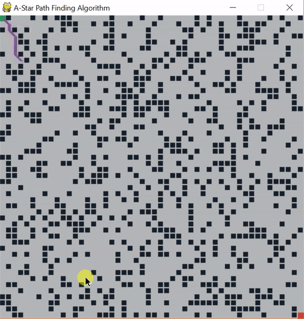

## A* Path Finding Algorithm

In computer science, A* (pronounced as "A star") is a computer algorithm that is widely used in pathfinding and graph traversal, the process of plotting an efficiently directed path between multiple points, called "nodes". It enjoys widespread use due to its performance and accuracy. However, in practical travel-routing systems, it is generally outperformed by algorithms which can pre-process the graph to attain better performance, although other work has found A* to be superior to other approaches.

# Pseudo-Code (Source: [Wiki/a-star-algorithm](https://en.wikipedia.org/wiki/A*_search_algorithm)):
function A*(start, goal)
    // The set of nodes already evaluated
    closedSet := {}

    // The set of currently discovered nodes that are not evaluated yet.
    // Initially, only the start node is known.
    openSet := {start}

    // For each node, which node it can most efficiently be reached from.
    // If a node can be reached from many nodes, cameFrom will eventually contain the
    // most efficient previous step.
    cameFrom := an empty map

    // For each node, the cost of getting from the start node to that node.
    gScore := map with default value of Infinity

    // The cost of going from start to start is zero.
    gScore[start] := 0

    // For each node, the total cost of getting from the start node to the goal
    // by passing by that node. That value is partly known, partly heuristic.
    fScore := map with default value of Infinity

    // For the first node, that value is completely heuristic.
    fScore[start] := heuristic_cost_estimate(start, goal)

    while openSet is not empty
        current := the node in openSet having the lowest fScore[] value
        if current = goal
            return reconstruct_path(cameFrom, current)

        openSet.Remove(current)
        closedSet.Add(current)

        for each neighbor of current
            if neighbor in closedSet
                continue		// Ignore the neighbor which is already evaluated.

            if neighbor not in openSet	// Discover a new node
                openSet.Add(neighbor)
            
            // The distance from start to a neighbor
            //the "dist_between" function may vary as per the solution requirements.
            tentative_gScore := gScore[current] + dist_between(current, neighbor)
            if tentative_gScore >= gScore[neighbor]
                continue		// This is not a better path.

            // This path is the best until now. Record it!
            cameFrom[neighbor] := current
            gScore[neighbor] := tentative_gScore
            fScore[neighbor] := gScore[neighbor] + heuristic_cost_estimate(neighbor, goal) 

    return failure

function reconstruct_path(cameFrom, current)
    total_path := [current]
    while current in cameFrom.Keys:
        current := cameFrom[current]
        total_path.append(current)
    return total_path
   
Below is demo of of A* algorithm in action:

  

  
